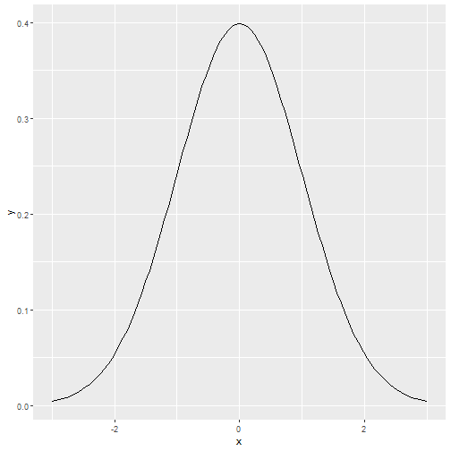

## It is a website created from shiny

---
## Code for ploting


```r
 # Get mm(0,1ean and sd value
mu <- as.numeric(input$mu)
sd <- as.numeric(input$sd)

# draw the normal distribution
g <- ggplot(data.frame(x= c(mu-3*sd, mu+3*sd)), aes(x)) +
    geom_function(fun = dnorm, args = list(mean = mu, sd = sd)) +
    xlim(mu-3,mu+3)
print(g)
```

---
## Plot


---
## Code in UI

```r
# Application title
titlePanel("DDP Week4 project"),

# Sidebar with a slider input for number of bins
sidebarLayout(
    sidebarPanel(
        # Get input "mean"
        textInput("mu", "mean", value = 0),
        
        # Get standard deviation
        textInput("sd", "standard deviation", value = 1)
    ),

    # Show a plot of the generated distribution
    mainPanel(
        textOutput("sen"),
        plotOutput("plot1")
    )
)
```
